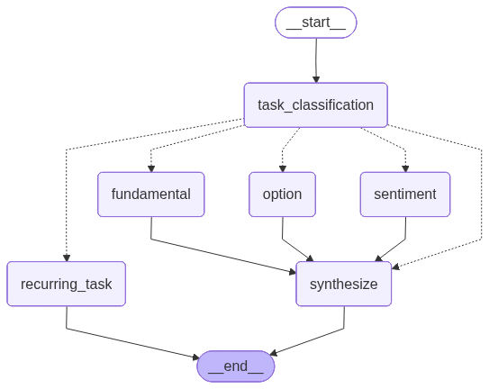

# trading-ai-assistant

An AI-powered trading research assistant built with LangGraph and Chainlit. Analyzes stocks across fundamental data, options chains, and market sentiment using a multi-agent graph architecture.



## Features

- **Fundamental analysis** — valuation metrics and financials via Finviz
- **Options analysis** — option chains and Greeks via Finviz
- **Sentiment analysis** — news aggregation and analysis via Finviz
- **Web UI** — conversational interface via Chainlit
- **CLI** — query the agent directly from the terminal
- **Caching** — Redis-backed response caching

## Requirements

### API Keys

Create a `.env` file in the project root:

```env
OPENAI_API_KEY=...
ANTHROPIC_API_KEY=...

FINVIZ_API_KEY=...
FINVIZ_EMAIL=not used
FINVIZ_PASSWORD=not used

PLAYWRIGHT_USER_DATA_DIR=[not used]/path/to/browser/user/data

REDIS_URL=redis://localhost:6379/0   # optional, defaults to this
```

| Variable | Description |
|---|---|
| `OPENAI_API_KEY` | OpenAI API key (used for main orchestration model) |
| `ANTHROPIC_API_KEY` | Anthropic API key (used for data analysis) |
| `FINVIZ_API_KEY` | Finviz Elite API key |
| `FINVIZ_EMAIL` | Finviz account email |
| `FINVIZ_PASSWORD` | Finviz account password |
| `PLAYWRIGHT_USER_DATA_DIR` | Path to Playwright browser profile directory (used for scraping) |
| `REDIS_URL` | Redis connection URL for caching |

### Dependencies

- Python 3.12+
- [uv](https://github.com/astral-sh/uv) package manager
- Redis (for caching)
- [just](https://github.com/casey/just) command runner

## Getting Started

```bash
# Install dependencies
uv sync

# Start Redis (if not already running)
docker run -d -p 6379:6379 -p 8001:8001 redis/redis-stack

# Run the web UI
just run

# Or query via CLI
just query make analysis of AAPL, what drives stock price now - sentiment or options or fundamental?
```

## Commands

| Command | Description |
|---|---|
| `just run` | Start the Chainlit web UI on port 8000 |
| `just query <question>` | Query the agent from the CLI |
| `just visualize [args]` | Generate/display the agent graph visualization |
| `just test` | Run the test suite |

## Third-party Resources

- https://www.gurufocus.com — fundamental stock data
- https://finviz.com — screener, charts, fundamentals
- https://www.tradingview.com — intraday charts, indicators
- https://www.barchart.com — option chains, Greeks
