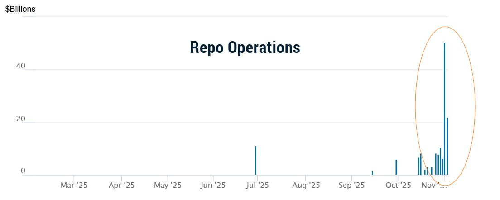

# Liquidity tracker

## Problem context

Fed Reserve just pumped $29.4 Billion into the U.S. Banking System through overnight repos 🤯 This amount far surpasses even the peak of the Dot Com Bubble 👀

### YahooFinance Fact Check

https://uk.finance.yahoo.com/news/fact-check-federal-allegedly-pumped-120000919.html

### HUGS Fund post

**Ось трохи деталей про вплив шатдауну на ринок**

Мова йде про обвал ліквідності на міжбанку.
Раніше відзначалося, що 31 жовтня ФРС провела рекордне денне вливанння в банківську систему. Зараз продовжують відзначатися рекордні обсяги репо між банками і ФРС. 3 листопада міжбанківська ставка SOFR (Secured Overnight Financing Rate) зросла одразу на 0,18%.

Наразі іншого пояснення цьому, як через зупинку роботи уряду США, немає.
Адже через шатдаун багато стандартних процесів у роботі різних відомств порушуються, а Мінфіну довелося перейти переважно на випуски "коротких" боргових інструментів, щоб хоч якось частково підтримувати фінансування в умовах зупинки роботи уряду. 

Мінфін, активно розміщуючи "короткі випуски", почав "висмоктувати" короткострокову ліквідність із системи, в результаті чого ставка SOFR злетіла. Одночасно, ФРС, намагаючись задовольнити попит на ліквідність на міжбанку, наростила обсяг операцій репо з банками + деякі експерти вважають, що ФРС також перейшла до "тонкого налаштування" і тихо вмикає друкарський верстат у такі складні моменти, знову ж таки для того, щоб згладити проблеми з ліквідністю.

Наразі ця ситуація розглядається, як короткострокова і що все прийде в норму після закінчення шатдауну. Тоді ліквідність піде в ринок і він знову перейде в ріст.

### GPT explanation

**What happened**

- On October 31, 2025, the Fed used its standing repo facility (SRF) to inject about $29.4 billion in cash into the banking system via overnight repurchase agreements (“repos”).
- Simultaneously, usage of the SRF hit a record – the total available loans through this tool reached about $50.35 billion that day.
- The move coincided with bank reserves slipping to about $2.8 trillion, a four-year low.
- This is the largest single-day liquidity injection via such a tool since the pandemic (2020) era.

**Why the Fed did it**

- Liquidity / funding stress
- Preventing a freeze / stress event
- Policy signalling
  - On the surface, the Fed has been hawkish (fighting inflation) and reducing its balance sheet. But this action suggests that they are also paying attention to financial stability and may ease if needed.

**My takeaway**

In sum: this $29.4 billion overnight repo injection is a caution flag, more than an outright crisis signal—but worth paying attention to. The plumbing (funding & liquidity) of the financial system is showing signs of being under pressure. The Fed stepped in to prevent a sharper immediate problem (e.g., a bank or fund getting squeezed) but that doesn’t mean everything is “fine” beneath the surface.

From your vantage (as someone who trades options and monitors broader market structure):

It suggests that liquidity risk (not just macro / policy risk) is front and center.

When the Fed’s actions diverge (tightening policy vs injecting liquidity), that creates ambiguity: “Are we still in inflation-fight mode or shifting to stability mode?” That’s an environment that can lead to increased volatility.
